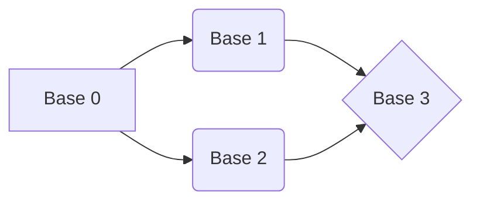

# ¡Bienvenidos a El Juego!

Aquí dentro encontrarán tres proyectos, cada uno tendrá lo solicitado para que los próximos juegos sean fructíferos. 

# Kitty-And-Puppy-Memory-Game

Este juego web pondrá al usuario en una situación  complicada. Elije con sabiduría o tu vida podrá correr peligro.

## Instalación:

Cambia de carpeta y dirígete a la carpeta del juego:

**cd kitty-and-puppy-memory-game**

Luego de esto instala las dependencias necesarias:

**npm install**

¡Ejecuta el juego y trata de divertirte! (Esta podría ser la última vez)

**npm start**

# Game-Database

Aquí está la Base de Datos justo como lo ordenó. Nuestra empresa ha crecido bastante en los últimos años y los juegos se han convertido cada vez más fructiferos.

## Visualización:

Entre a la carpeta de la base de datos

**cd game-database**

Aquí abra el editor de código de su preferencia. Visual Studio Code **cof cof** 

Y podrá observar el esquema y la base de datos con las siguientes tablas:

| Empleados | Jugadores | Sede | Cargos | Eliminación|
|-----------|-----------|------|--------|---------------|
| Id_Empleado | Id_Jugador | Id_Sede| Id_Cargo | Id_Jugador Elminado|
|Nombre| Nombre | Nombre_Sede | Nombre_Cargo | Id_Empleado_Eliminador |
| Edad | Edad | Localizacion_Sede | | Fecha_Eliminacion|
| Sexo | Sexo | | | Id_Sede_Eliminacio |
| Id_Cargo | Status |
| Id_Sede | Id_Sede|
| | Id_Empleado_Eliminador |

# Shortest-Path

Hemos creado un algoritmo para encontrar la menor distancia entre nuestras bases y así poder llegar al destino de la manera más rápida posible.

## Instalación

Entra en la carpeta destino:

**cd shortest-path**

Instale las dependencias:

**npm install**

Ejecuta los test para saber cual de nuestras bases es la mejor para salir:

**npm test**

Y observa como calcula como llegar más rápido a la base destino

